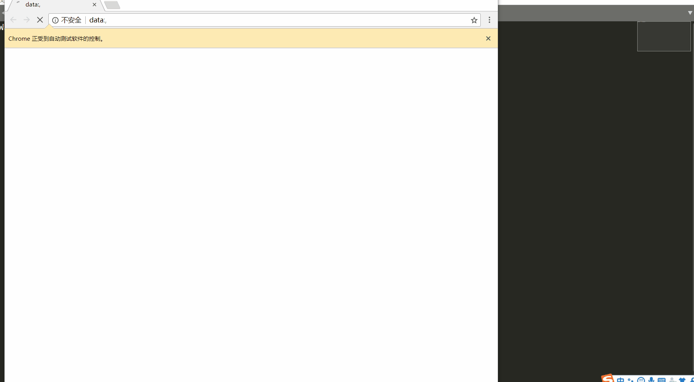

# 冲顶大会的辅助工具

## 介绍

- 该脚本通过抓包获取题目，相对于截图OCR识别题目更快
- 至少能在题目出现的4s前获取到题目，并自行搜索
- record.txt 是最近的题库, 有时间就去更新一下

## 环境
- python3
- request库
- selenium库
- chromedriver (这里selenium使用的是Chrome浏览器，其他浏览器自行百度)

## 实现思路

- 脚本通过抓包获取题目
- 脚本运行时， 会打开三个自动控制的浏览器， 获取到题目之后就会用百度自动搜索
- 通过三个浏览器分别搜索 "题目 + ' ' + 选项", 称它为三次搜索法
    - 因为单纯搜题目有时搜不到结果
    - 且当题目问的是下列哪个选项时，不加上选项搜索就会很鸡肋
    - 同时，三个选项中其中有一个必定是答案，那么这样搜索准确率就高很多了

## 使用

- 运行该脚本即可

## 使用截图

*下图以冲顶大会中的一题 以下哪个词和猪八戒没关系 为例*

- 该脚本运行时，会先打开三个浏览器(因为脚本搜索的思路)
- 用win键+方向键来进行分屏，这样容易观察
- 获取题目后，脚本会自行搜索，你要做的是看一下哪个是正确答案
- 12题过后，脚本会把本次的题目保存到record.txt中

## 目前缺陷

- 虽然脚本可以自动搜索，但是最终还是需要人工肉眼来筛
    + 肉眼筛大部分时候都是能直接看到答案的！！ 这个放心
    + 因为目前还没想到比较好的算法来筛答案
    + 如果以每个选项出现的次数来筛，这样也不太行，干扰项有时很多，同时有时候问题是“下列哪一项不是”，这种时候另外两个搜到的频率肯定高，也会导致错误
- 该脚本目前来说还只能算是辅助类，还不能达到100%的正确率！！
